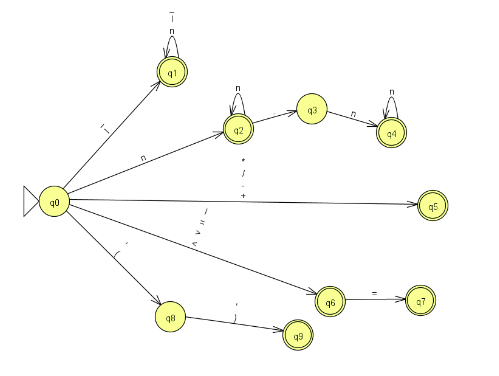

# Analizador Léxico en Python

Este proyecto es un **analizador léxico** que identifica y clasifica los distintos **tokens** usados en un archivo fuente personalizado. Desarrollado como parte del curso de Compiladores.

## Objetivo

Leer un archivo llamado `fuente.txt`, línea por línea, y detectar elementos léxicos como identificadores, palabras clave (`print`, `var`, `if`, etc.), operadores, símbolos, números y cadenas. Muestra en consola los tokens reconocidos y señala los errores léxicos cuando aparecen símbolos no válidos.

## Estructura

```
analizador/
├── analizador.py    # Código del analizador léxico (el que compartiste)
├── fuente.txt       # Archivo fuente que será analizado
└── README.md        # Este archivo
```

## Cómo ejecutar

1. Asegúrate de tener Python instalado.
2. Coloca tu código Python como `analizador.py`.
3. Asegúrate de tener el archivo `fuente.txt` con contenido válido.
4. Ejecuta desde consola:

```bash
python analizador.py
```

---

## Tokens que reconoce

| Token        | Significado                        | Ejemplo                |
|--------------|------------------------------------|------------------------|
| `ID`         | Identificadores                    | `number`, `text`       |
| `NUMBER`     | Números (enteros o decimales)      | `10`, `3.14`           |
| `STRING`     | Cadenas entre comillas             | `"Hola mundo"`         |
| `EQUALS`     | Asignación                         | `=`                    |
| `EQ`         | Igualdad                           | `==`                   |
| `NE`         | Diferente                          | `!=`                   |
| `LE` / `GE`  | Menor o igual / Mayor o igual      | `<=`, `>=`             |
| `LT` / `GT`  | Menor que / Mayor que              | `<`, `>`               |
| `PLUS`       | Suma                               | `+`                    |
| `MINUS`      | Resta                              | `-`                    |
| `TIMES`      | Multiplicación                     | `*`                    |
| `DIVIDE`     | División (o inicio de comentario)  | `/`                    |
| `LPAREN`, `RPAREN` | Paréntesis                   | `(`, `)`               |
| `WHITESPACE` | Espacios (se ignoran)              | ` `, `\t`              |

---

## Autómata del Lenguaje
A continuación se presenta el autómata diseñado para reconocer los tokens válidos del lenguaje:


---

## Ejemplo de entrada (`fuente.txt`)

```plaintext
start_main
    / Declaracion de variables con diferentes tipos
    var number = int, 10
    var text = string, "Sebastián Calderón"
    var flag = bool, true
    var counter = int, 0
    var pi = double, 3.14
    var name = string, "Boteo"

    / Ciclo que cuenta hasta 5
    loop counter < 5
        counter + 1 = counter
    endloop

    / Condicional basico
    if flag == true
        "flag is true" = text
    endif

    / Asignacion y uso de variables float
    number + pi = number
    show(number)

    / Condicional con else (simulado con otro if)
    if number > 13
        "number is big" = text
        show(text)
    endif

    / Segundo ciclo: impresión repetida
    var i = int, 0
    loop i < 3
        "Loop #" = text
        show(text)
        i + 1 = i
    endloop

    / Condicional anidado
    if number >= 13
        if flag == true
            "Valid number and flag" = text
            show(text)
        endif
    endif

    / Operaciones con booleanos y strings
    "Hola " = text
    text + name = text
    show(text)

    / Condiciones con comparadores diferentes
    if counter != 0
        "Counter is not zero" = text
        show(text)
    endif

    / Operaciones matematicas
    number * 2 = number
    number - 5 = number
    number / 3 = number
    show(number)

endmain
```

---

## Resultado esperado

Al ejecutar el código, se imprime en consola algo así:

```
✔ Token 'ID' reconocido: 'start_main' (Línea 1)
✔ Token 'DIVIDE' reconocido: '/' (Línea 2)
✔ Token 'ID' reconocido: 'Declaracion' (Línea 2)
...
❌ Error léxico en línea 3: ','
✔ Token 'NUMBER' reconocido: '10' (Línea 3)
...
```

---

## Notas finales

- Los espacios en blanco son ignorados.
- Se marcan como errores los caracteres no definidos en los patrones de `tokens`, como `,`.
- Puedes personalizar el código para aceptar más estructuras o palabras clave.

---

🧑‍💻 **Desarrollado por**: Sebastián Calderón  
📚 **Materia**: Teoria de Autómatas y Compiladores  
🏫 **Universidad Técnica Particular de Loja**
